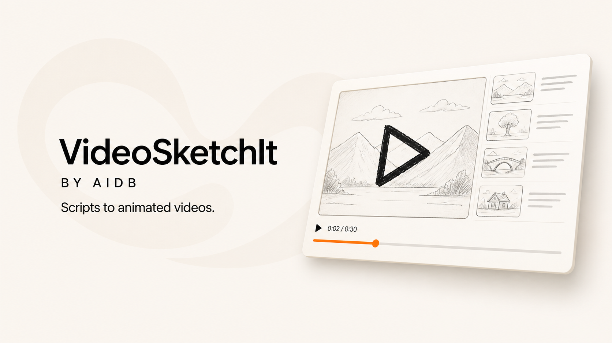

# VideoSketchIt

**Turn scripts and narration into animated sketch videos.**

> ### Use your existing ChatGPT plan
>
> VideoSketchIt connects through Codex using **Sign in with ChatGPT**. No OpenAI API key is required for the default workflow. Planning and illustration generation use your available Codex allowance, while animation and final video rendering run locally.
>
> Usage limits depend on your ChatGPT plan. Additional credits may be required after your included usage is exhausted.



VideoSketchIt by AIDB is a local, open-source video creator and an independent adaptation of [ChenShuo2004/cs-board](https://github.com/ChenShuo2004/cs-board). The current AI provider uses each user's own ChatGPT/Codex sign-in for planning and illustrations. Audio processing, alignment, animation, project files, and final rendering remain on the user's computer. The product identity is provider-independent so additional agents and services can be added in future releases.

> ### Sponsored by AIDB
>
> Discover AI tools, workflows, and practical resources at **[The AIDB Platform](https://theaidb.net)**.

- Independent frontend: `http://127.0.0.1:13010`
- Independent backend: `http://127.0.0.1:18775`
- Independent history and configuration: `.videosketchit/`
- Recommended installer: [Pinokio launcher](launcher/README.md)
- License: [MIT](LICENSE)

This is an unofficial community adaptation, not an OpenAI product and not a replacement for the original repository. The current release supports Codex as its AI provider; VideoSketchIt itself is not named for or limited to one provider. If you want the original Windows/OpenLux workflow, use the [upstream project](https://github.com/ChenShuo2004/cs-board).

## What this edition changes

- Uses Codex as the current provider for script analysis, storyboarding, and image generation.
- Supports **finished narration uploads** from ElevenLabs, a microphone recording, or another voice service. This is the fastest route and does not need a local TTS server.
- Retains optional local voice cloning through compatible Qwen3-TTS or IndexTTS Gradio services.
- Adds an English interface, Mac launchers, Windows launchers, checkpoint recovery, job history, custom visual references, and dynamic infographic mode.
- Does not send the active planning or image-generation path to OpenLux.

Each user signs in with their own account. Codex officially supports ChatGPT sign-in for subscription access or API-key sign-in for usage-based access. This project defaults to ChatGPT sign-in; availability and usage limits depend on the user's plan and workspace. Never commit or share `.codex/auth.json`.

## Platform status

| Platform | Status | Launcher |
| --- | --- | --- |
| macOS Apple Silicon | Tested | Double-click `VideoSketchIt.command`, or use Pinokio |
| macOS Intel | Expected to work; community testing needed | Double-click `VideoSketchIt.command`, or use Pinokio |
| Windows 11 | Launcher included; real Windows validation still required before calling it fully supported | Double-click `VideoSketchIt.bat`, or use Pinokio |
| Linux | Not packaged or tested | Manual setup may work |

## Before installing

You need:

1. A ChatGPT account with Codex access, or an OpenAI Platform API key.
2. The [Codex CLI](https://developers.openai.com/codex/cli) available as `codex`, or the ChatGPT desktop app on macOS.
3. Approximately 3–8 GB of free disk space. Optional Whisper and voice models require additional space.
4. Internet access for installation and Codex image generation.

The recommended **Upload Finished Narration** workflow does not require Qwen3-TTS or IndexTTS. Install a local voice service only if you want the app to synthesize narration from a short reference sample.

## Installation

### How to open VideoSketchIt after installation

You do **not** need to reinstall VideoSketchIt each time you use it.

#### On a Mac

1. Open the `videosketchit` folder that was created during installation.
2. Find **`VideoSketchIt.command`**.
3. Double-click it.
4. Wait while the launcher starts VideoSketchIt. The Terminal window may close when startup is complete.
5. VideoSketchIt should open automatically in your browser at `http://127.0.0.1:13010`.

If macOS blocks the file the first time, Control-click `VideoSketchIt.command`, choose **Open**, and then choose **Open** again. You normally only need to do this once.

> `start-videosketchit.command` is the technical Terminal launcher used behind the scenes. Most Mac users should ignore it and double-click `VideoSketchIt.command` instead.

#### On Windows

1. Open the `videosketchit` folder that was created during installation.
2. Double-click **`VideoSketchIt.bat`**.
3. Wait while the launcher starts VideoSketchIt. The Command Prompt window may close when startup is complete.
4. VideoSketchIt should open automatically in your browser at `http://127.0.0.1:13010`.

#### If you installed with Pinokio

Open Pinokio, select VideoSketchIt, choose **Start**, and then choose **Open VideoSketchIt**.

If the browser does not open automatically, open Chrome, Safari, or Edge and enter `http://127.0.0.1:13010` in the address bar. Double-clicking the launcher again is also safe; it will open the already-running app rather than create a second copy. Your projects remain saved on your computer.

### Method 1 — Let Codex install it (easiest)

This is the recommended route for non-technical users. Open Codex on the computer where you want to install the app, start a new task, and paste this prompt:

```text
Read this repository page and install VideoSketchIt in English:
https://github.com/montorox/videosketchit

Install it in a new, separate folder without replacing any existing CS Board installation. Inspect the README and installer files, check the required software, install the dependencies, use my existing Codex sign-in where possible, start the app, and verify that it opens at http://127.0.0.1:13010/. When finished, tell me the exact installation folder and show me the one file I should double-click whenever I want to use VideoSketchIt again. Ask me before any step that requires my login, password, or approval.
```

Keep Codex open while it works. It can inspect the repository, run the appropriate Mac or Windows installation steps, diagnose common setup errors, launch the services, and verify the local page. You may still need to approve software installation or complete a browser sign-in yourself.

After installation, use **Upload Finished Narration** for the quickest first test: upload a complete MP3/WAV and paste the matching script.

### Method 2 — Install with Pinokio

Pinokio is the simplest installation path on Mac and Windows because the repository already contains an installer and launcher definition.

1. Install [Pinokio](https://pinokio.computer/).
2. Download or clone this repository to your computer.
3. Open the repository's `launcher` folder in Pinokio.
4. Select **Install** and wait for the Python, frontend, and renderer dependencies to finish.
5. Select **Start**, then select **Open VideoSketchIt**.
6. In the app, open **Connections** and choose **Sign in with ChatGPT** if your Codex session is not already detected.
7. For the fastest first test, select **Upload Finished Narration**, upload the complete MP3/WAV and paste the matching script.

Pinokio starts the interface at `http://127.0.0.1:13010`. Generated files and settings are stored in `.videosketchit/` and are excluded from Git. Existing `.cs-board-codex/` data from an earlier release is migrated automatically.

### Method 3 — Manual installation on macOS

#### 1. Install system requirements

Install Git, Python 3.11, Node.js 22, `uv`, and FFmpeg. With Homebrew:

```bash
brew install git python@3.11 node@22 uv ffmpeg
```

Install Codex using the [official Codex CLI instructions](https://developers.openai.com/codex/cli), then authenticate:

```bash
codex login
codex login status
```

#### 2. Download and install the app

```bash
git clone https://github.com/montorox/videosketchit.git
cd videosketchit

python3.11 -m venv .venv
uv pip install --python .venv/bin/python -r webapp/requirements.txt

cd web
npm install
npm run build
cd ../video_renderer
npm install
cd ..

.venv/bin/python scripts/prepare_env.py --check
```

#### 3. Start the app

```bash
chmod +x start-videosketchit.command VideoSketchIt.command
```

Installation is now complete. In Finder, open the `videosketchit` folder and double-click `VideoSketchIt.command`. The launcher starts both local services and opens `http://127.0.0.1:13010`.

Terminal users may run `./start-videosketchit.command` instead.

### Method 4 — Manual installation on Windows 11

The Windows launcher is included, but this build still needs validation on a real Windows 11 machine. Until that test is complete, describe Windows support as **preview**.

#### 1. Install system requirements

Install these applications and ensure their commands are available in PowerShell:

- [Git for Windows](https://git-scm.com/download/win) — `git`
- [Python 3.11](https://www.python.org/downloads/windows/) — `py -3.11`
- [Node.js 22 LTS](https://nodejs.org/) — `node` and `npm`
- [`uv`](https://docs.astral.sh/uv/getting-started/installation/) — `uv`
- [FFmpeg](https://ffmpeg.org/download.html) — `ffmpeg` and `ffprobe`
- [Codex CLI](https://developers.openai.com/codex/cli) — `codex`

Open a new PowerShell window and confirm:

```powershell
git --version
py -3.11 --version
node --version
npm --version
uv --version
ffmpeg -version
codex --version
codex login
codex login status
```

#### 2. Download and install the app

```powershell
git clone https://github.com/montorox/videosketchit.git
Set-Location videosketchit

py -3.11 -m venv .venv
uv pip install --python .venv\Scripts\python.exe -r webapp\requirements.txt

Push-Location web
npm install
npm run build
Pop-Location

Push-Location video_renderer
npm install
Pop-Location

.venv\Scripts\python.exe scripts\prepare_env.py --check
```

#### 3. Start the app

Double-click `VideoSketchIt.bat`, or run:

```powershell
.\start-videosketchit.bat
```

The launcher starts both local services and opens `http://127.0.0.1:13010`.

## Create your first video

### Fast route: use a finished voiceover

1. Select **Upload Finished Narration**.
2. Upload the complete MP3, WAV, M4A, AAC, FLAC, or OGG file.
3. Paste the exact script used to record or generate that audio.
4. Select Standard, Custom References, or Dynamic Infographic mode.
5. Choose a style and select **Generate Video**.

The script is still required because it supplies the meaning used for scene planning, illustrations, key phrases, subtitle text, and audio alignment. The uploaded audio supplies the voice, delivery, pauses, and final duration.

### Optional route: clone a voice locally

1. Start a compatible Qwen3-TTS or IndexTTS Gradio service.
2. Open **Connections** and enter its local URL (normally `http://127.0.0.1:7860`).
3. Select **Clone a Reference Voice**.
4. Upload a clean 10–30 second voice sample and paste the target script.

Only clone a voice that you own or have permission to use.

## Troubleshooting

### “Codex was not found”

Run `codex --version`. If Codex is installed in a custom location, set `CODEX_BIN` to its executable path before starting the app.

### ChatGPT sign-in is not detected

Run `codex login`, finish the browser flow, then confirm with `codex login status`. Restart this app afterward.

### FFmpeg or FFprobe is missing

Install FFmpeg and confirm that both `ffmpeg -version` and `ffprobe -version` work in a new terminal.

### Voice cloning fails

The finished-narration workflow does not need a voice server. If cloning is required, confirm the local Gradio endpoint is running and test it from **Connections**.

### First infographic job is slow

The first run may download a Whisper alignment model. Later jobs reuse the cached model.

## Privacy and credentials

- Job data, uploaded media, logs, and generated videos stay in `.videosketchit/` unless you move or share them.
- `.videosketchit/`, the legacy `.cs-board-codex/`, `.venv/`, `node_modules/`, media outputs, `.env` files, and logs are excluded by `.gitignore`.
- Never publish `.codex/auth.json`, API keys, tokens, private voice samples, or generated client projects.
- Do not expose the local backend or Codex execution to an untrusted public network.

## Credits and upstream project

VideoSketchIt is based on [ChenShuo2004/cs-board](https://github.com/ChenShuo2004/cs-board), released under the MIT License. The original author describes the upstream project as a local tool for turning reference audio and Chinese scripts into whiteboard animation videos. Please star and credit the upstream project as well as this adaptation.

For the original Windows/OpenLux-oriented edition, installation questions, and upstream changes, use the [original repository](https://github.com/ChenShuo2004/cs-board).

---

## Original technical documentation

# AI 文案转动画视频

将中文文案和参考声音自动制作成解说视频。目前包含两条互不干扰的制作路径：标准白板手绘，以及按真实旁白时间驱动的动态信息图。

适合把知识讲解、故事口播、课程字幕或短视频文案制作成暖米黄色纸张底的手绘动画。

## 效果示例

**场景：猴子山抢香蕉** —— 随着字幕的叙事顺序，依次绘制假山与小猴、抢香蕉的大猴，以及围观小朋友。


原始线稿：[查看 PNG](examples/scene-01-monkey-mountain.png)。

## 核心能力

- 解析 SRT 字幕，并按建议的 25–35 秒时长拆分场景
- 先输出分镜与配图策略，确保每一幕只表达一个核心意思
- 按字幕事件而非画面坐标，为元素建立语义化的绘制顺序
- 用 `annotation.json` 管理区域、时序、字幕关联和重叠保护区
- 每个区域采用连续流式笔迹：先 `ink` 铺线稿，再 `color` 添彩
- 支持浏览器预览台调整区域、顺序、时间和字幕关联
- 支持逐幕渲染与多幕合并，输出完整 MP4

## 动态信息图模式

动态信息图本质上是“旁白驱动的动态 PPT”。它严格按“短语时间表 → 内容结构 → Remotion PPT → PPT 插图”的顺序制作，时间不由 Remotion、语言模型或字数估算。

- 完整旁白首先生成独立的 `phrase-timeline.json`，每条短语都有真实音频起止时间
- 文案分析模型负责每页核心观点、One-Liner、关键词、视觉策略和叙事衔接，只能引用已有短语编号
- 存在连续编号章节时，总览页直接提取章节名称，避免模型将标题改写成抽象能力词
- 普通清单默认没有箭头；只有原文明确表达步骤或因果时，Remotion 才能绘制方向关系
- `deck-spec.json` 在图片生成前完成，图片模型只能填充已确定的插图槽位
- 元素入场帧使用真实语音起点并向上取整，画面不能抢在旁白前出现
- 章节切页以新页面原文第一个被识别 token 为准；旁白停顿时保留上一页
- 总标题和当前章节标题可跨页保留，内容元素出现后一直停留到本页结束
- 对齐覆盖率或置信度不达标时直接停止，不允许退回按字数、页长或平均间隔估算
- 底部字幕仍可开关；开启时也使用真实语音时间

完整规则见 [动态信息图语义时间契约](docs/semantic-timing-contract.md)。

## 工作方式

该 Skill 的关键在于“字幕驱动、逐步确认”。每一步完成后都等待确认，避免在分镜、线稿或标注尚未定稿时浪费渲染成本：

1. 解析 SRT，输出分镜与配图策略。
2. 确认后生成统一风格的线稿。
3. 确认线稿后，结合字幕和原图创建标注，并载入预览台。
4. 确认标注后，生成分区与方向检查图。
5. 在预览台调整区域、叙事顺序、时序和字幕关联并保存。
6. 确认最终标注后，逐幕渲染 MP4。
7. 多幕项目在确认各幕成片后合并。

## 视觉规范

- 暖米黄色纸张背景：建议 `#F5EBD7`
- 深灰色素描线条，红、橙、蓝仅作少量概念性点缀
- 极简手绘、干净背景与充足留白
- 不使用场景文字、标签、摄影感、3D 效果或复杂纹理

## 安装与环境

Skill 自带独立的 Python 虚拟环境准备脚本。首次运行时执行：

```bash
python scripts/prepare_env.py --check
python scripts/prepare_env.py
```

成功后第一条命令会输出 `ENV_PY=<路径>`；后续渲染请使用该解释器，确保依赖隔离。

网页工作台与动态信息图还需要 Node.js 22。首次使用时分别安装前端和 Remotion 渲染依赖：

```bash
cd web && npm install
cd ../video_renderer && npm install
```

动态信息图第一次对齐旁白时会自动下载 Whisper.cpp 1.5.5 和多语言 `medium` 模型，之后复用本地缓存。资源受限时可设置 `INFOGRAPHIC_WHISPER_MODEL=small`，但中文专有词的时间对齐质量会下降。

## 项目素材结构

```text
assets/whiteboard/<项目名>/
├── scene-01-<名称>.png
├── scene-01-<名称>.annotation.json
├── scene-01-<名称>-whiteboard.mp4
└── scene-01-<名称>-preview.mp4
```

图片与标注必须同名，例如 `scene-01-demo.png` 对应 `scene-01-demo.annotation.json`。

## 标注格式

每个元素使用原图的整数像素坐标，并通过 `sequence`、`subtitle` 与 `narrativeRole` 关联字幕中的事件。区域应按“场景铺垫 → 关键人物/物体 → 动作或变化 → 反应/结果”排序。

```json
{
  "sceneId": "scene-01",
  "canvas": { "width": 1672, "height": 941 },
  "storyBasis": "小猴在猴子山上拿着香蕉，大猴抢走香蕉，孩子们在旁观看。",
  "sceneDurationMs": 9000,
  "elements": [
    {
      "id": "rockery",
      "label": "猴子山场景",
      "sequence": 1,
      "narrativeRole": "故事的场景铺垫",
      "subtitle": "小猴子坐在猴子山顶，手里拿着香蕉。",
      "type": "structure",
      "region": { "x": 20, "y": 120, "width": 540, "height": 780 },
      "reveal": {
        "direction": "top_to_bottom",
        "startMs": 300,
        "durationMs": 2600,
        "maskPaddingPx": 22,
        "protectedRegions": []
      },
      "handPath": { "start": [290, 130], "end": [290, 890], "easing": "easeInOut" }
    }
  ]
}
```

`direction` 和 `handPath` 用于预览台的矩形代理；最终成片的真实笔迹由流式绘制器自动生成。对于相互遮挡的对象，在较早元素的 `protectedRegions` 中标出需要延后显示的区域，避免后续内容提前露出。

## 常用命令

解析字幕并生成建议分镜：

```bash
python scripts/parse_srt.py <字幕.srt> --target-sec 30 --min-sec 25 --max-sec 35
```

生成区域检查图：

```bash
python scripts/render_annotation_preview.py <图片路径> <标注路径> <预览图输出路径>
```

打开 `assets/preview.html`，使用“打开文件夹”载入场景目录，即可编辑区域、顺序、时间与字幕关联。

渲染单幕：

```bash
<ENV_PY> scripts/render_stream_whiteboard.py <图片路径> <标注路径> <输出.mp4> assets/drawing-hand.png \
  --ink-path grid --color-fill contour-wipe
```

合并多幕：

```bash
<ENV_PY> scripts/merge_scenes.py --inputs 幕1.mp4 幕2.mp4 幕3.mp4 --output final.mp4
```

## 质量检查

- 首帧是干净的暖米黄纸张底色，没有提前露出的线条
- `canvas` 与原图尺寸一致，所有区域都是画布内的整数像素坐标
- `sequence`、`startMs` 与字幕的叙事顺序一致
- 中段帧中，未开始区域和保护区不会提前出现
- 笔尖贴近当前流式笔迹；线稿清晰时可选择 `--ink-path skeleton`
- 每幕结束后至少停留 0.5 秒完整画面；多幕合并顺序与字幕分镜一致

## 仓库内容

```text
srt-whiteboard-animation/
├── SKILL.md                         # 完整工作流与约束
├── assets/
│   ├── drawing-hand.png              # 手部素材
│   ├── preview.html                  # 本地编辑预览台
├── examples/                         # README 案例素材
├── scripts/
│   ├── parse_srt.py                  # 字幕解析与分镜建议
│   ├── render_annotation_preview.py  # 标注检查图
│   ├── render_stream_whiteboard.py   # 流式笔迹 MP4 渲染器
│   ├── merge_scenes.py               # 多幕合并
│   └── prepare_env.py                # 依赖环境准备
└── agents/openai.yaml                # Codex 元数据
```

## 贡献

欢迎提交 Issue 或 Pull Request。任何涉及绘制逻辑的改动，都应使用真实的字幕、标注和成片检查遮罩保护、时序与最终画面。

## 许可证

本项目基于 MIT License 开源，详见 [LICENSE](LICENSE)。

## 关于作者

一个爱养鱼的老登 / AI Builder / 用 AI 团队打造一人公司。

抖音、B站、公众号：江哥是老登啊

---

## Acknowledgements

This project is an independent adaptation of **CS Board**, originally created and maintained by [ChenShuo2004](https://github.com/ChenShuo2004).

- Original repository: [https://github.com/ChenShuo2004/cs-board](https://github.com/ChenShuo2004/cs-board)
- Original license: [MIT License](https://github.com/ChenShuo2004/cs-board/blob/main/LICENSE)

The upstream project provided the foundation for the whiteboard-animation workflow, rendering tools, semantic timing system, and browser workspace. VideoSketchIt adds a separate provider and authentication path, English-facing workflows, macOS support, finished-narration uploads, and other independent changes. It is a community adaptation and is not presented as an official release or endorsement by the upstream maintainer.

Please visit and support the original repository. Users who want the original edition should install it directly from the upstream link above.
